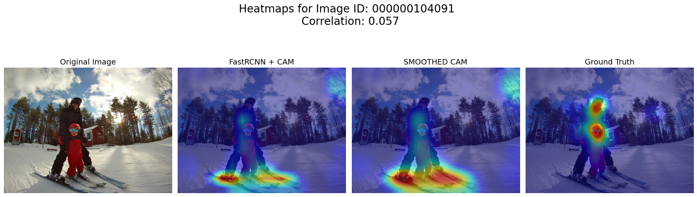
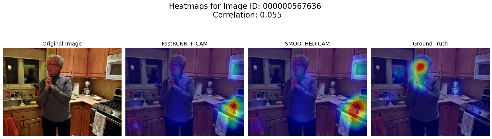
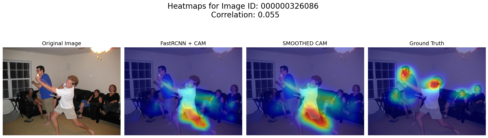

# Differences
______
______
## Sign Inversion (due to Eigenvector equivalence)
PCA attempts to find the eigenvector $v$ where $Av = \lambda v$. The issue is that because $v$ and $-v$ both satisfy the equation, resulting PCA weights can have same magnitudes but flipped vector directions. This is particularly random and will vary. By simple inspection of the least correlated images, it is apparent that signs are completely inverted, even though the model recognizes the region. This mathematical phenomenon explains virtually all the least correlated images. This can be shown via sign flip, which is partly shown in Deep Dive on Bottom 25 subfolder. Interestingly, this affects food objects, especially those circular and near depth with high textures. Many food images show sign flipping, possibly due to edge detection but wrong sign attribution.

Examples below:

______
______
## Model + EigenCAM Design
While FPN layers contain feature maps that represent a wide range of spatial dimensions, the largest pitfall is the inability of EigenCAM to calculate feature maps of different dimensions after flattening and reshaping. Additionally, it is virtually impossible to perform traditional SVD to get PCs on layer 1 spatial dimensions (120x160). It takes about 19200 x 19200 ~ 369 million bits or 1.47 GB of RAM just to initialize the square matrix. Add in intermediate matrices, and it easily surpasses 10 GB of RAM used.

Reshaping all 1280 channels to a singular dimension introduces another challenge. If the dimensions are reshaped to lowest spatial size by default (pool layer 8x10), this is akin to **heavily** blurring finer spatial layers like layer 1's 120x160, as well as the other intermediate layers. This likely causes too much information loss in learned feature maps of larger spatial dimensions, and the expected result is that textures and other detailed patterns become too distorted to activate. The advantage of this is greater computational and memory efficiency.

On the other hand, as mentioned earlier, it is impossible to upsample all layers to 120x160, nor does it make sense because no new information is gained (would simply hook FPN layer 1 instead). A better compromise is layer 3 and/or 4, which have higher spatial dimensions, but still allow EigenCAM to run reasonably fast. I do this in the Deep Dive on Bottom 25 section. 

Examples below:

______
______
## Text/Sign Bias
Humans tend to automatically fixate on readable text (signs, labels, billboards) due to learned reading behavior. The model is likely trained without a text object category. Thus, features do not learn text specific patterns because there is a likely a lack of gradient signal. The result is minimal activation in these textual regions. This cultural/task-specific bias suggests that text is a notable source of misalignment. It is apparent that bottom-up saliency models that humans implicitly follow and task-specific detection models, such as FasterRCNN + FPN, capture fundamentally different aspects of visual attention.

Examples below:

______
______
## Human Misalignment
While both models and humans exhibit saliency towards human objects, there are multiple reasons for misalignment in saliency. As in the first image below, the model likely places much larger emphasis on high probability objects like skis, while clothing and glasses obfuscate the detection of human objects. By contrast, human fixation directly focuses on faces of the humans, thus displaying a misalignment due to human bias.

Even in human-centric images, the model's learned context outweighs human object recognition in activations. As seen in the second image below, the background scene and appliance context outweighs the person in the image, whereas human fixation is directed to the human in the image. Furthermore, as seen in the third image below, the model fixates solely on the human's bent leg, suggesting that it places emphasis on pose and orientation of a human rather than facial fixation seen across ground truth saliency maps.

Examples below:

