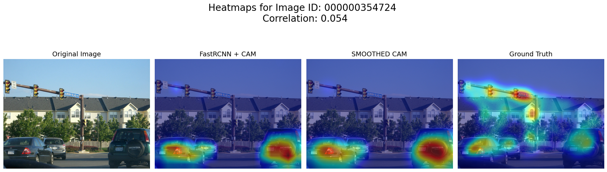
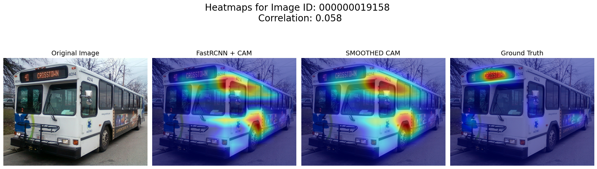
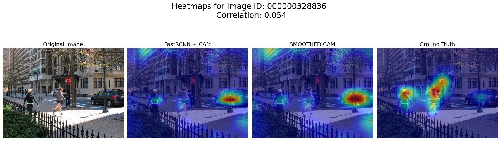

# Differences
______
______
## Sign Inversion (due to Eigenvector equivalence)
PCA attempts to find the eigenvector $v$ where $Av = \lambda v$. The issue is that because $v$ and $-v$ both satisfy the equation, resulting PCA weights can have same magnitudes but flipped vector directions. This is particularly random and will vary. By simple inspection of the least correlated images, it is apparent that signs are completely inverted, even though the model recognizes the region. This mathematical phenomenon explains virtually all the least correlated images. This can be shown via sign flip, which is partly shown in Deep Dive on Bottom 25 subfolder. Interestingly, this affects food objects, especially those circular and near depth with high textures. Many food images show sign flipping, possibly due to edge detection but wrong sign attribution.

Examples below:

______
______
## Text/Sign Bias
Humans tend to automatically fixate on readable text (signs, labels, billboards) due to learned reading behavior. The model is likely trained without a text object category. Thus, features do not learn text specific patterns because there is a likely a lack of gradient signal. The result is minimal activation in these textual regions. This cultural/task-specific bias suggests that text is a notable source of misalignment. It is apparent that bottom-up saliency models that humans implicitly follow and task-specific detection models, such as FasterRCNN + FPN, capture fundamentally different aspects of visual attention.

Examples below:

______
______
## Human Bias
Humans are naturally
