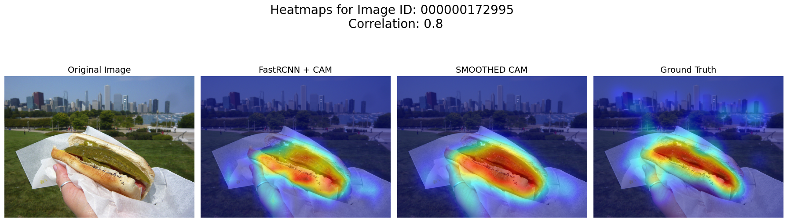
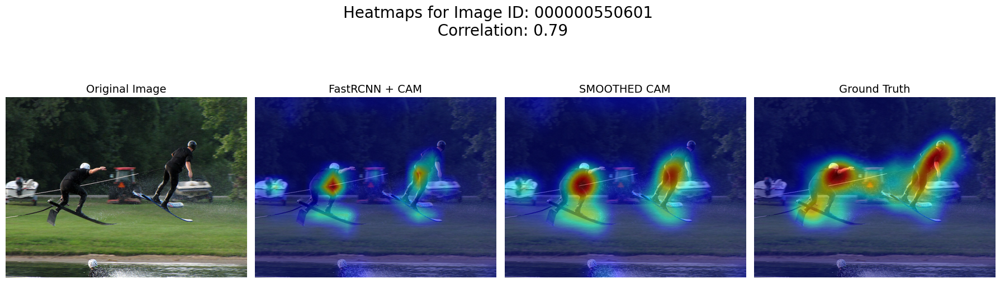

# Differences
______
______
## Sign Inversion (due to Eigenvector equivalence)
PCA attempts to find the eigenvector $v$ where $Av = \lambda v$. The issue is that because $v$ and $-v$ both satisfy the equation, resulting PCA weights can have same magnitudes but flipped vector directions. This is particularly random and will vary. By simple inspection of the least correlated images, it is apparent that signs are completely inverted, even though the model recognizes the region. This mathematical phenomenon explains virtually all the least correlated images. This can be shown via sign flip, which is partly shown in Deep Dive on Bottom 25 subfolder. Interestingly, this affects food objects, especially those circular and near depth with high textures. Many food images show sign flipping, possibly due to edge detection but wrong sign attribution.

Examples below:

______
______
## Scene Cluttering
One of the key advantages of FPNs is better ability to process distant scenes. In particular, the model can combine "big picture" scenes with large number of objects detected in the background because the receptive field is a combination of various spatial sizes, from fine to coarse. Since the default downsamples all FPN layers to 8x10 spatial regions, the receptive field is huge (albeit blurry). Nevertheless, the model can still delineate the contrast between background and salient foreground.

Objects that are similar but larger have greater saliency. This is apparent in the image of the tanker and cars at a distant overhead angle. To declutter the scene, this combination of FPN layers detect similar objects (cars, tankers), but places heavy emphasis on the larger object due to larger contrast. This tracks with the architecture of the model, where the 8x10 pool dimensions dominate.

Examples below:

## Task Alignment (Detecting Objects in Focus)
Some images clearly delineate an object focus, which produces a background blurring effect. This is essentially similar to how humans focus on images, as objects that are clearly in focus tend to have higher saliency. This model, as well as many other CNN based models, thrive at detecting sensitivity to texture variance. In other words, when images have a natural sharpness to blur contrast (which happens when photographs/humans focus on something nearer in depth), models are able place high saliency on those borders where the contrast occurs.

Examples below: 

