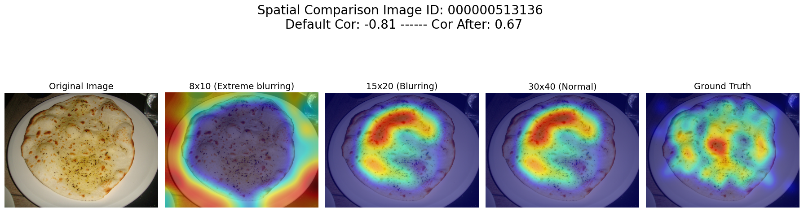
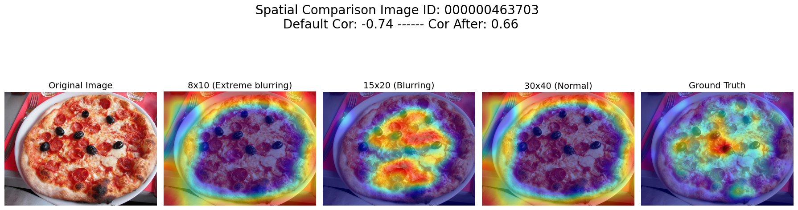
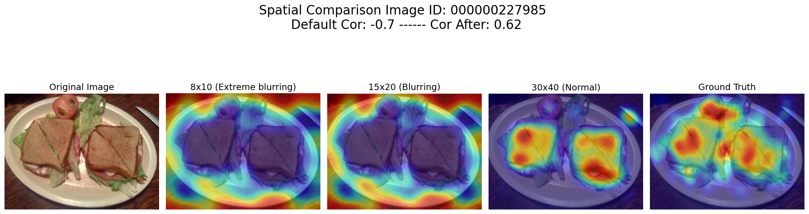
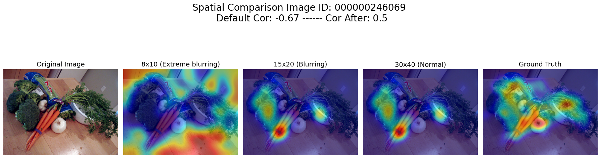
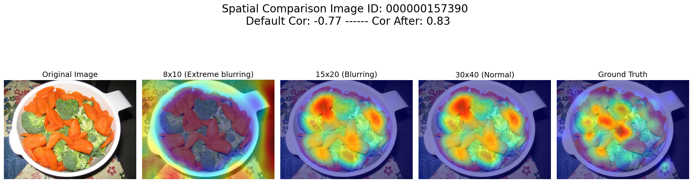
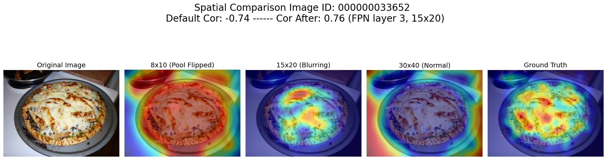
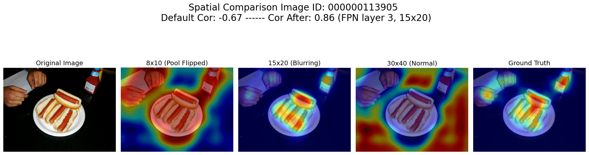
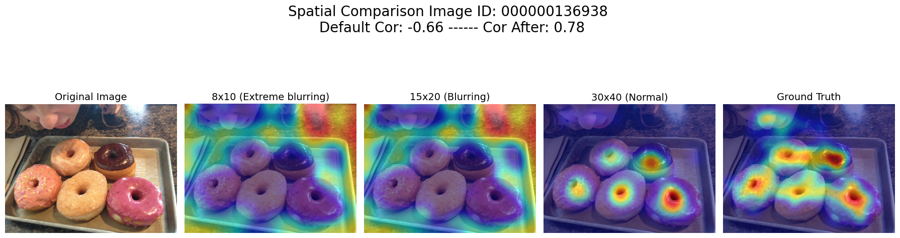

# Explanations
This deeper dive involves performing two different modifications to the Bottom 25 Correlated images. The first modification is rather simple, involving just flipping the signs of the existing EigenCAM generated maps to "correct" for random sign flips. This essentially flips the correlation altogether, making the sign positive while keeping magnitude same.

The second modification is reproducing smoothed EigenCAM maps using layer 3 (30x40) and layer 4 (15x20) dimensions instead of the original pool size. In other words, a (1x1280x30x40) and then a (1x1280x15x20) tensor is passed to EigenCAM instead of the original (1x1280x8x10). Note that the same sign flipping issue may or may not appear in these two new EigenCAMs, but visually it should be easy to determine.

The results are contained in this subdirectory above. Each smoothed CAM map is compared side by side, and the highest correlation out of the three maps is displayed in the titled. Obviously, flipping the signs of the original lowest correlations will serve as a floor. More importantly is:

1. Whether the most salient feature map activations changed drastically between spatial dimensions
2. Whether these new saliency maps correlate more than the pooled layer

The results mostly suggest that the original pooled layer stay the most highly correlated, but finer features are being increasingly emphasized (particularly toppings on pizza). In some cases, even though the correlation may not be higher than original, finer spatial feature maps visually look closer to the human fixation. 

Examples Below:

In some cases, the newly generated saliency maps outperform the original pool layer, particularly in images with high granularity and textural features at a close distance.

Examples Below:

