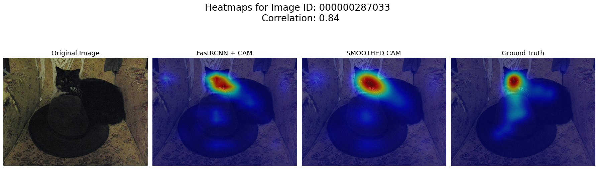

# Similarities
______
______
## Object Themes
The most dominant objects by far are dogs and cats. This pretty much suggests model bias, as the model is likely trained on many instances of cats and dogs. More importantly, some representation of combination of features in FPN layers is very dominant (many of these high correlation images have 15 to 20% explained variance through the top component).

But FasterRCNN + FPN are trained on the same images as SALICON dataset (COCO images). It could just be that humans and models find faces salient, no matter what. Specifically, of all the cats and dog images, it is quite apparent that faces dominant saliency.

Examples below:

______
______
